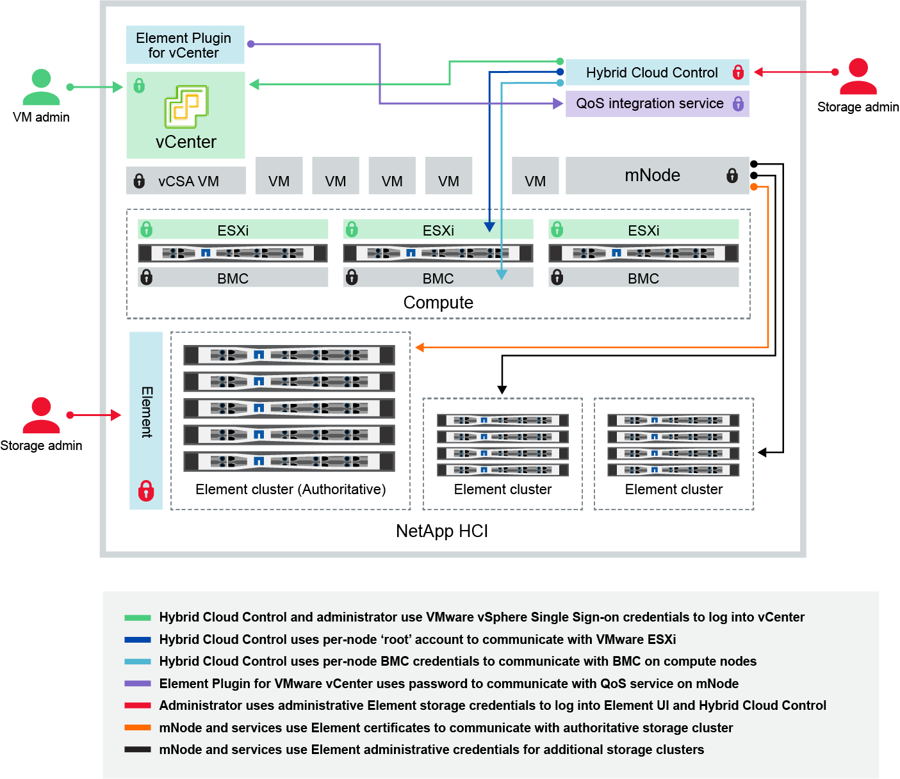

= Alterar credenciais no NetApp HCI e no NetApp SolidFire
:allow-uri-read: 
:url-peak: https://kb.netapp.com/Advice_and_Troubleshooting/Data_Storage_Software/Element_Plug-in_for_vCenter_server/mNode_Status_shows_as_'Network_Down'_or_'Down'_in_the_mNode_Settings_tab_of_the_Element_Plugin_for_vCenter_(VCP)
:icons: font
:imagesdir: ../media/

[role="lead"]
Dependendo das políticas de segurança na organização que implantou o NetApp HCI ou o NetApp SolidFire, alterar credenciais ou senhas geralmente faz parte das práticas de segurança. Antes de alterar as senhas, você deve estar ciente do impactos em outros componentes de software na implantação.

Se você alterar credenciais para um componente de uma implantação do NetApp HCI ou do NetApp SolidFire, a tabela a seguir fornece orientações sobre o impactos em outros componentes.

Interações do componente NetApp HCI: 

[cols="10a,60a,30a"]
|===
| Tipo e ícone de credencial | Utilização por Admin | Consulte estas instruções 

 a| 
Credenciais do elemento

image::../media/icon_lock_red.png[Ícone de cadeado vermelho]
 a| 
*Aplicável a*: NetApp HCI e SolidFire

Administradores usam essas credenciais para fazer login:

* Interface de usuário do Element no cluster de storage do Element
* Controle de nuvem híbrida no nó de gerenciamento (mnode)

Quando o Hybrid Cloud Control gerencia vários clusters de armazenamento, ele aceita apenas as credenciais de administrador para os clusters de armazenamento, conhecido como o cluster _autoritative_ para o qual o mnode foi configurado inicialmente. Para clusters de storage adicionados mais tarde ao Hybrid Cloud Control, o mnode armazena com segurança as credenciais de administrador. Se as credenciais para clusters de armazenamento adicionados posteriormente forem alteradas, as credenciais também devem ser atualizadas no mnode usando a API mnode.
 a| 
* https://docs.netapp.com/us-en/element-software/storage/concept_system_manage_manage_cluster_administrator_users.html["Atualize as senhas de administrador do cluster de armazenamento"^].
* Atualize as credenciais de administrador do cluster de armazenamento no mnode usando o https://docs.netapp.com/us-en/element-software/api/reference_element_api_modifyclusteradmin.html["API de modificação exclusiva"^].

 a| 
Credenciais de logon único do vSphere

image::../media/icon_lock_green_light.png[Ícone de cadeado verde claro]
 a| 
*Aplicável a*: Apenas NetApp HCI

Os administradores usam essas credenciais para fazer login no VMware vSphere Client. Quando o vCenter faz parte da instalação do NetApp HCI, as credenciais são configuradas no mecanismo de implantação do NetApp da seguinte forma:

* com a senha especificada, e.
* com a senha especificada. Quando um vCenter existente é usado para implantar o NetApp HCI, as credenciais de logon único do vSphere são gerenciadas pelos administradores da VMware DE TI.

 a| 
link:task_hci_credentials_vcenter_esxi.html#update-the-esxi-password-by-using-the-management-node-rest-api["Atualize as credenciais do vCenter e do ESXi"]. 

 a| 
Credenciais do controlador de gerenciamento de placa base (BMC)

image::../media/icon_lock_black.png[Ícone de bloqueio preto]
 a| 
*Aplicável a*: Apenas NetApp HCI

Os administradores usam essas credenciais para fazer login no BMC dos nós de computação do NetApp em uma implantação do NetApp HCI. O BMC fornece monitoramento básico de hardware e recursos de console virtual.

As credenciais BMC (às vezes chamadas de _IPMI_) para cada nó de computação NetApp são armazenadas com segurança no nó mnode nas implantações do NetApp HCI. O controle de nuvem híbrida da NetApp usa credenciais BMC  na capacidade de uma conta de serviço para se comunicar com o BMC nos nós de computação durante atualizações de firmware de nós de computação.

Quando as credenciais do BMC são alteradas, as credenciais dos respetivos nós de computação devem ser atualizadas também no nó mnode para reter toda a funcionalidade de Controle de nuvem híbrida.
 a| 
* link:hci_prereqs_final_prep.html["Configure o IPMI para cada nó no NetApp HCI"].
* Para nós de H410C, H610C e H615C, link:hci_prereqs_final_prep.html["Altere a senha padrão do IPMI"].
* Para nós de H410S e H610S, https://docs.netapp.com/us-en/element-software/storage/task_post_deploy_credential_change_ipmi_password.html["Altere a senha padrão do IPM"^].
* link:task_hcc_edit_bmc_info.html["Altere as credenciais do BMC no nó de gerenciamento"].

 a| 
Credenciais ESXi

image::../media/icon_lock_green_dark.png[Ícone de cadeado verde escuro]
 a| 
*Aplicável a*: Apenas NetApp HCI

Os administradores podem fazer login em hosts ESXi usando SSH ou DCUI local com uma conta raiz local. Nas implantações do NetApp HCI, o nome de usuário é 'root' e a senha foi especificada durante a instalação inicial desse nó de computação no mecanismo de implantação do NetApp.

As credenciais raiz do ESXi para cada nó de computação do NetApp são armazenadas com segurança no nó mnode nas implantações do NetApp HCI. O Controle de nuvem híbrida da NetApp usa as credenciais em uma capacidade de conta de serviço para se comunicar diretamente com os hosts ESXi durante as atualizações de firmware do nó de computação e verificações de integridade.

Quando as credenciais raiz ESXi são alteradas por um administrador da VMware, as credenciais dos respetivos nós de computação devem ser atualizadas no nó mnode para manter a funcionalidade de Controle de nuvem híbrida.
 a| 
link:task_hci_credentials_vcenter_esxi.html["Atualizar credenciais para hosts do vCenter e do ESXi"].

 a| 
Palavra-passe de integração QoS

image::../media/icon_lock_purple.png[Ícone de cadeado roxo]
 a| 
*Aplicável a*: NetApp HCI e opcional no SolidFire

Não é usado para logins interativos por administradores.

A integração de QoS entre o VMware vSphere e o Element Software é habilitada por:

* Plug-in Element para vCenter Server, e.
* Serviço de QoS no mnode.

Para autenticação, o serviço QoS usa uma senha que é exclusivamente usada neste contexto. A senha de QoS é especificada durante a instalação inicial do plug-in Element para vCenter Server ou gerada automaticamente durante a implantação do NetApp HCI.

Sem impactos em outros componentes.
 a| 
link:https://docs.netapp.com/us-en/vcp/vcp_task_qossioc.html["Atualize as credenciais do QoSSIOC no plug-in do NetApp Element para o vCenter Server"^]. 

A senha do plug-in do NetApp Element para o vCenter Server SIOC também é conhecida como _QoSSIOC password_. 

Consulte o artigo de base de dados do vCenter Server.

 a| 
Credenciais do vCenter Service Appliance

 a| 
*Aplica-se a*: NetApp HCI somente se configurado pelo mecanismo de implantação do NetApp

Os administradores podem fazer login nas máquinas virtuais do vCenter Server Appliance. Nas implantações do NetApp HCI, o nome de usuário é 'root' e a senha foi especificada durante a instalação inicial desse nó de computação no mecanismo de implantação do NetApp. Dependendo da versão do VMware vSphere implantada, certos administradores no domínio de logon único do vSphere também podem fazer login no dispositivo.

Sem impactos em outros componentes.
 a| 
Não são necessárias alterações. 

 a| 
Credenciais de administrador do nó de gerenciamento do NetApp

image::../media/icon_lock_gray_light.png[Ícone de bloqueio cinzento claro]
 a| 
*Aplicável a*: NetApp HCI e opcional no SolidFire

Os administradores podem fazer login nas máquinas virtuais do nó de gerenciamento do NetApp para configuração avançada e solução de problemas. Dependendo da versão do nó de gerenciamento implantada, o login via SSH não é habilitado por padrão.

Nas implantações do NetApp HCI, o nome de usuário e  a senha foram especificados pelo usuário durante a instalação inicial desse nó de computação no mecanismo de implantação do NetApp.

Sem impactos em outros componentes.
 a| 
Não são necessárias alterações. 

|===

== Encontre mais informações

* https://docs.netapp.com/us-en/element-software/storage/reference_post_deploy_change_default_ssl_certificate.html["Altere o certificado SSL padrão do software Element"^]
* https://docs.netapp.com/us-en/element-software/storage/task_post_deploy_credential_change_ipmi_password.html["Altere a senha do IPMI para nós"^]
* https://docs.netapp.com/us-en/element-software/storage/concept_system_manage_mfa_enable_multi_factor_authentication.html["Ativar a autenticação multifator"^]
* https://docs.netapp.com/us-en/element-software/storage/concept_system_manage_key_get_started_with_external_key_management.html["Comece a usar o gerenciamento de chaves externas"^]
* https://docs.netapp.com/us-en/element-software/storage/task_system_manage_fips_create_a_cluster_supporting_fips_drives.html["Criar um cluster compatível com unidades FIPS"^]

